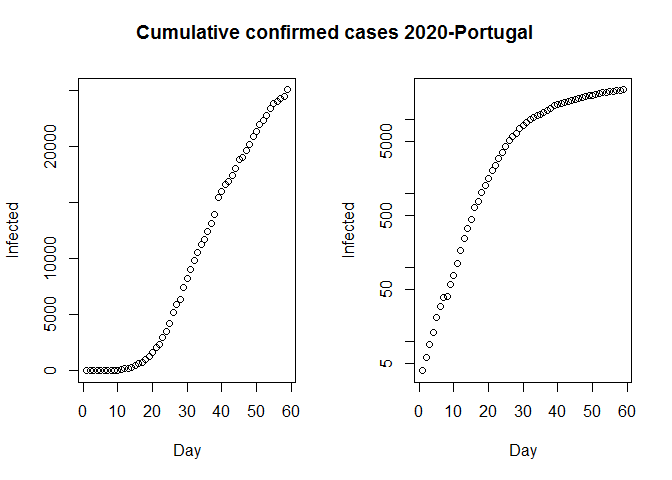
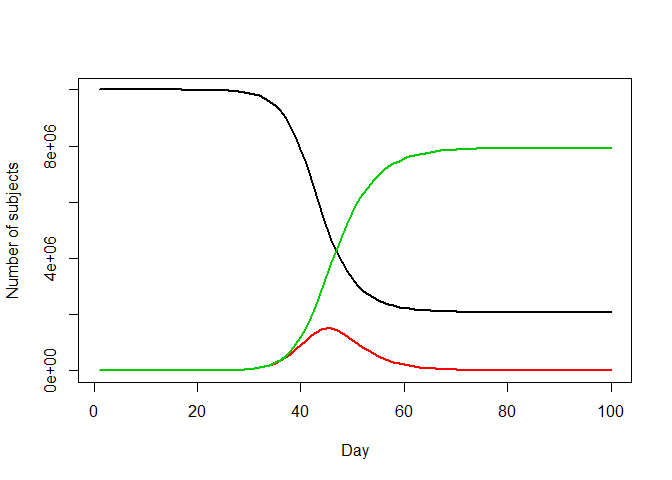
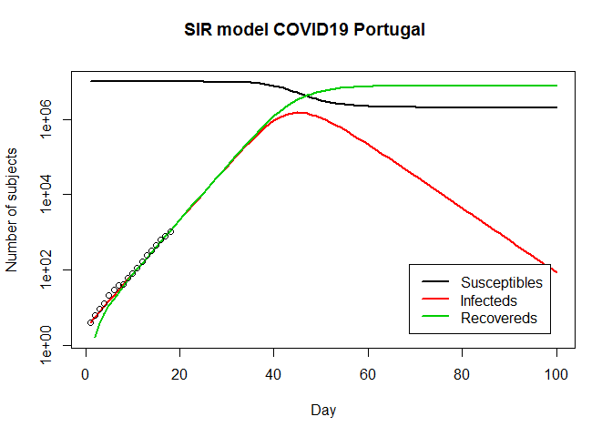

Dinâmica do coronavirus em Portugal
================

## Introdução

Este post foi feito para fins didacticos e pretende ajudar a entender
melhor como é possível construir um modelo matemático para estudar a
evolução da doença Covid19, provocada pelo vírus SARS-CoV2, e aplicar
esse modelo ao caso português. Surgiu na sequência de alguma pesquisa e
da leitura do seguinte post
<https://blog.ephorie.de/epidemiology-how-contagious-is-novel-coronavirus-2019-ncov?fbclid=IwAR35_eyO1Ry6Bru04WKKPNv7mxt5rhNT_liU6QlEqJ8u-BrOZoVHxxJ0>
. Antes de mais nada, a minha formação académica é em Química e
Biotecnologia, por isso tenho algumas bases científicas, contudo não sou
especialista em epidemiologia. Talvez devido a esse facto, resolvi
aprender a trabalhar com o software R e aprofundar os meus conhecimentos
sobre esta doença. Este trabalho não se destina a fazer nenhuma
previsão, nem ser uma ferramenta de tomada de decisões, sendo apenas
uma primeira abordagem (imperfeita) de aproximação à realidade,
destinando-se apenas a ilustrar alguns conceitos científicos de
estatística, epidemiologia e modelação. Para a metodologia escolhi usar
o software R para os cálculos estatísticos e fazer modelação dos dados.
Portanto, a primeira pergunta é:

## “Como é possível aos epidemiologistas estimarem o grau de contágio do vírus e como a epidemia evolui?”

Para responder a esta questão a abordagem clássica é através de modelos
que tentam simular a realidade e assim prever a evolução de uma
determinada epidemia, ajudando dessa forma na tomada de decisões
informadas sobre estratégias de saúde pública, ou outras, de combate à
sua propagação (medidas de quarentena, isolamento social, higienização,
vacinação, etc).

Existem diversos modelos disponíveis, porém aqui vamos usar o modelo
SIR, talvez um dos mais populares (poderá consultar mais informação
sobre diversos modelos existentes nesta página
<https://en.wikipedia.org/wiki/Compartmental_models_in_epidemiology>).
Os dados estatísticos relativos ao número de pessoas infectadas, que
usaremos provêm das autoridades oficiais portuguesas, a Direcção Geral
de Saúde (DGS), e podem ser consultados aqui
(<https://covid19.min-saude.pt/relatorio-de-situacao/>). As análises
adicionais serão minhas.

## “Por que é tão importante criarmos modelos?”

A saúde e a economia são duas faces de qualquer epidemia. Por um lado,
precisamos salvar vidas e, por outro, precisamos manter nossos empregos,
serviços sociais e todas as atividades que precisamos para sobreviver
(agricultura, indústria, serviços e outras). Precisamos de ter
estratégias para alcançarmos um equilíbrio entre a saúde e economia. Na
minha opinião, numa primeira fase deveremos fazer um esforço para salvar
vidas. Portanto, as medidas de isolamento social devem ser tão
restritivas quanto as necessárias para evitar o colapso do sistema de
saúde, mas também não as poderemos prolongar indefinidamente no tempo
ou provocaremos uma crise económica com consequências também graves para
a sociedade. Numa segunda fase, deveremos retomar as actividades
económicas numa situação de maior controlo das variáveis que
influenciam a transmissão do vírus (nomeadamente o R0). Uma vez que
poderemos ter novamente um aumento de casos quando as medidas de
quarentena são levantadas. Quanto à imunidade de grupo, estudos estimam
que esta se atinge quando, pelo menos, cerca de 60% da população fica
imunizada contra um agente infeccioso (mas ainda decorrem investigações
para elucidar esta questão quanto ao caso da Covid19). Enquanto não
existir uma vacina ou adquirirmos a imunidade de grupo necessitamos de
continuar vigilantes quanto à progressão da doença, daí a necessidade
destes modelos, para tomarmos decisões informadas. Surge então a questão
seguinte:

## “Em que fase da epidemia estamos em Portugal agora? “

O primeiro passo será analisarmos os casos confirmados acumulados no
tempo e para tal precisamos encontrar uma fonte confiável disponível.
Como os dados da DGS estão em arquivos PDF no seu website, precisamos de
uma solução melhor para adquirir rapidamente os dados de maneira
automática. A solução que podemos usar é recorrer a uma tabela que
contenha os mesmos dados mas que está em código html, pelo que recorri à
seguinte fonte:
<https://pt.wikipedia.org/wiki/Pandemia_de_COVID-19_em_Portugal#Evolu%C3%A7%C3%A3o_dos_casos>
). Com algum código em R podemos selecionar os dados de interesse
(código é fornecido em anexo). Outra solução, será adquirimos os dados
em um arquivo (formato csv ou txt) ou inserirmos os mesmos manualmente
no código, mas não vou desenvolver este tema mais aqui pois existem
diversos tutoriais sobre o software R para quem quiser aprofundar estes
conhecimentos. Ter em atenção que caso existam alterações nas páginas de
onde retiramos on-line a informação poderemos ter de reajustar o código.
Então visualizando os dados graficamente:

``` r
#Inseri os valores de Portugal até dia 17-04-2020:

Day <- 1:(length(Infected))
N <- 10000000 # população de Portugal
 
old <- par(mfrow = c(1, 2))
plot(Day, Infected, type ="b")
plot(Day, Infected, log = "y")
#abline(lm(log10(Infected) ~ Dia))
title("Cumulative confirmed cases 2020-Portugal", outer = TRUE, line = -2)
```

<!-- -->

O gráfico à esquerda é o total acumulado de pessoas infectadas ao longo
do tempo (em dias desde o início do primeiro caso detectado) e à direita
o mesmo gráfico, mas com uma escala logarítmica no eixo y (um gráfico
log-linear). No segundo gráfico parece bastante claro que a curva está a
“aplanar”, mostrando que em Portugal no momento actual terminamos o
crescimento exponencial, ou seja, a taxa de crescimento é muito mais
lenta agora. Veremos mais detalhadamente esta questão adiante.

# Modelação dos dados

Chegamos então à modelação dos dados com o modelo SIR, cuja ideia básica
é bastante simples. Existem três grupos de pessoas: aqueles que são
saudáveis, mas susceptíveis à doença (S), os infectados (I) e as
pessoas que se recuperaram (R): Para modelar a dinâmica do surto,
precisamos de três equações diferenciais, uma para a mudança em cada
grupo, onde é o parâmetro que controla a transição entre S e I e que
controla a transição entre I e R:


Source: wikipedia

O modelo pode ser representado por:

\[\frac{dS}{dt} = - \frac{\beta I S}{N}\]

\[\frac{dI}{dt} = \frac{\beta I S}{N}- \gamma I\]

\[\frac{dR}{dt} = \gamma I\]

Inserindo as equações no modelo temos:

``` r
SIR <- function(time, state, parameters) {
  par <- as.list(c(state, parameters))
  with(par, {
    dS <- -beta/N * I * S
    dI <- beta/N * I * S - gamma * I
    dR <- gamma * I
    list(c(dS, dI, dR))
    })
}
```

Inserimos as equações anteriores no modelo e de seguida precisamos de
duas funções: uma para resolver as equações e outra para optmizar. Para
a primeira usaremos a função “Ode” do pacote “deSolve” (CRAN) e para a
optimização usaremos a ferramenta de base do R, ou seja, um método de
minimização da soma da diferença quadrática entre o número de infectados
e o número de casos previstos pelo modelo, ao longo do tempo (t):

\[RSS(\beta, \gamma) = \sum_{t} \left( I(t)-\^{I}(t) \right)^2\]

Resolvendo, obtêm-se convergência (indicada pelo software) e os
seguintes parâmetros e .

Após uma prévia análise exploratória dos dados escolhemos apenas os
pontos que pertencem a uma fase de crescimento exponencial até ao dia
20-03-2010.  
Escolhemos apenas estes dias porque sabemos da literatura que este
modelo não integra as variáveis de distanciamento social que tomamos em
Portugal em 16-03-2020, com o fecho das escolas, e depois em 18-03-2020,
foi decretado o “Estado de Emergência”, além das medidas de
higienização. Assim vamos estimar por excesso (obviamente) numa
situação hipotética em que nada teria sido feito para evitar a
progressão dos contágios. Podemos então fazer a representação gráfica:

<!-- -->

    ## Warning in xy.coords(x, y, xlabel, ylabel, log = log): 1 y value <= 0 omitted
    ## from logarithmic plot

<!-- -->

Observando os gráficos tal como previsto temos um bom ajuste dos dados
reais à curva prevista pelo modelo. Assim, temos uma primeira
aproximação à realidade e permite estimar alguns coeficientes. Num
próximo post vamos tentar usar um modelo mais realista. Devemos também
ter em conta que uma “curva epidémica” deve ser feita com as “datas de
início dos sintomas” (tal como podemos verificar nos boletins oficiais)
e aqui estamos a usar os casos confirmados por não termos outros dados.
Outro factor é que a qualidade dos dados é muito importante para a
qualidade do modelo.

# Estimativa de R0

Agora poderemos extrair algumas estatísticas importantes. Um dos
coeficientes é o chamado número básico de reprodução ou taxa básica de
reprodução, R0 (“R nought” em inglês) que mostra basicamente quantas
pessoas saudáveis são infectadas por uma pessoa doente em média (número
médio de contágios):

``` r
par(old)
 
R0 <- setNames(Opt_par["beta"] / Opt_par["gamma"], "R0")
R0
```

    ##      R0 
    ## 1.98384

``` r
##       R0 
## 1.98384
 
fit[fit$I == max(fit$I), "I", drop = FALSE] # height of pandemic
```

    ##          I
    ## 45 1505232

``` r
##            I
## 37 616443.4
 
max(fit$I) * 0.02 # max deaths with supposed 2% fatality rate
```

    ## [1] 30104.65

``` r
## [1] 12328.87
```

Assim, o R0 é estimado em 1,9 na fase inicial da epidemia no país, o que
é consistente com o número que muitos pesquisadores e a OMS estimaram
sendo aproximado do valor do SARS, Influenza ou Ébola. Existem diversos
valores estimados que vão desde 1,4 até 3,5 para este parâmetro
(<https://www.worldometers.info/coronavirus/#repro>). De notar ainda que
este R0 vem diminuindo ao longo do tempo passando a designar-se Rt ou Re
(R efectivo), senbdo neste momento inferior a 1 segundo a DGS (pode
variar de região para região). Além disso, de acordo com este modelo, o
pico da epidemia seria alcançado em torno de 16-04-2020 (45 dias após o
início). Como já referido a curva epidémica deverá ser construída com a
data de início de sintomas e não de casos laboratoriais confirmados,
pelo que podemos considerar uma média de 7 dias entre o início de
sintomas e detecção laboratorial, logo se retirarmos 7 dias, terá sido
na primeira semana de Abril, também não muito longe de algumas
informações oficiais. Neste modelo hipotético a extensão da epidemia
seria cerca de 1,5 milhões de pessoas infectadas e cerca de 30000 óbitos
(assumindo taxa de mortalidade de 2%), o que claramente está
sobrestimado. Como discutido anteriormente, este número está estimado
para o pior cenário possível, sem quaisquer medidas, assumindo um modelo
deterministico aleatório de transmissão. Isto pode dever-se ao modelo
ser demasiado simplista por não incluir as variáveis de distanciamento
social e/ou de outras medidas tomadas (portanto, estes números são muito
altos). Outro factor que podemos ter é que existem muitos casos
assintomáticos e estes nunca foram testados. Só saberemos quantas
pessoas estiveram realmente expostas ao vírus através de testes
serológicos à população. Portanto, não entremos em pânico, vamos tentar
criar um modelo melhor para o caso português, num próximo post.

# Bibliografia consultada

<https://www.nytimes.com/2020/04/23/world/europe/coronavirus-R0-explainer.html>

<https://covid19.min-saude.pt/relatorio-de-situacao/>

<https://wikiciencias.casadasciencias.org/wiki/index.php/Modelo_SIR_em_epidemiologia>

<https://wwwnc.cdc.gov/eid/article/26/7/20-0282_article>

<https://www.worldometers.info/coronavirus/#repro>
